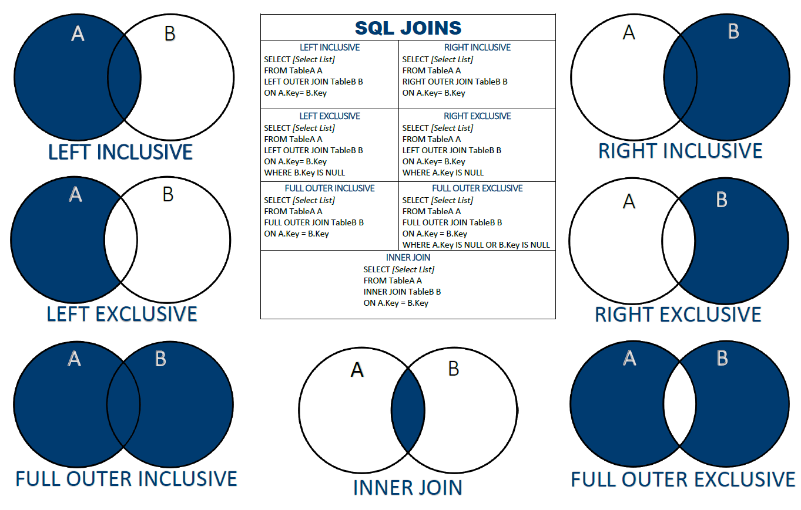

## 源数据

### 表结构

```sql
create table if not exists `a`(
    `id` int auto_increment,
    `astr1` varchar(4),
    `astr2` varchar(4),
    `bid` int,
    primary key (`id`)
);
create table if not exists `b`(
    `id` int auto_increment,
    `bstr1` varchar(4),
    `bstr2` varchar(4),
    primary key (`id`)
);
```

### 表 a

| id  | astr1 | astr2 | bid |
| --- | ----- | ----- | --- |
| 1   | A     | AA    | 1   |
| 2   | B     | BB    | 2   |
| 3   | C     | CC    | 3   |
| 4   | D     | DD    | 4   |
| 5   | E     | EE    | 1   |
| 6   | F     | FF    | 2   |
| 7   | X     | XX    | 11  |
| 8   | Y     | YY    | 12  |
| 9   | Z     | ZZ    | 11  |

### 表 b

| id  | bstr1 | bstr2 |
| --- | ----- | ----- |
| 1   | aa    | a     |
| 2   | bb    | b     |
| 3   | cc    | c     |
| 4   | dd    | d     |
| 5   | ee    | e     |
| 6   | ff    | f     |
| 7   | xx    | x     |
| 8   | yy    | y     |
| 9   | zz    | z     |

## A ∩ B

使用 inner join

```sql
select *
from a
inner join b
on a.bid=b.id;
```

也可使用笛卡尔乘积，然后指定条件

```sql
select *
from a,b
where a.bid=b.id;
```

### inner join 结果

| a.id | astr1 | astr2 | bid | b.id | bstr1 | bstr2 |
| ---- | ----- | ----- | --- | ---- | ----- | ----- |
| 1    | A     | AA    | 1   | 1    | aa    | a     |
| 2    | B     | BB    | 2   | 2    | bb    | b     |
| 3    | C     | CC    | 3   | 3    | cc    | c     |
| 4    | D     | DD    | 4   | 4    | dd    | d     |
| 5    | E     | EE    | 1   | 1    | aa    | a     |
| 6    | F     | FF    | 2   | 2    | bb    | b     |

结果显示：

- 若 a.bid 中有在 b.id 中找不到的记录，丢弃
- 若 b.id 中有在 a.bid 中找不到的记录，丢弃
- 在 a.bid 和 b.id 都存在的记录，保留

| 结果是否包含记录 | b.id 有 | b.id 无 |
| ---------------- | ------- | ------- |
| a.bid 有         | 是      | 否      |
| a.bid 无         | 否      | -       |

## A (A ∩ B + A\*)

使用 left join

```sql
select *
from a
left join b
on a.bid=b.id;
```

### left join 结果

| a.id | astr1 | astr2 | bid | b.id   | bstr1  | bstr2  |
| ---- | ----- | ----- | --- | ------ | ------ | ------ |
| 1    | A     | AA    | 1   | 1      | aa     | a      |
| 2    | B     | BB    | 2   | 2      | bb     | b      |
| 3    | C     | CC    | 3   | 3      | cc     | c      |
| 4    | D     | DD    | 4   | 4      | dd     | d      |
| 5    | E     | EE    | 1   | 1      | aa     | a      |
| 6    | F     | FF    | 2   | 2      | bb     | b      |
| 7    | X     | XX    | 11  | `NULL` | `NULL` | `NULL` |
| 8    | Y     | YY    | 12  | `NULL` | `NULL` | `NULL` |
| 9    | Z     | ZZ    | 11  | `NULL` | `NULL` | `NULL` |

结果显示：

- 若 a.bid 中有在 b.id 中找不到的记录，保留
- 若 b.id 中有在 a.bid 中找不到的记录，丢弃
- 在 a.bid 和 b.id 都存在的记录，保留

| 结果是否包含记录 | b.id 有 | b.id 无 |
| ---------------- | ------- | ------- |
| a.bid 有         | 是      | 是      |
| a.bid 无         | 否      | -       |

## B (A ∩ B + B\*)

使用 right join

```sql
select *
from a
right join b
on a.bid=b.id;
```

### right join 结果

| a.id   | astr1  | astr2  | bid    | b.id | bstr1 | bstr2 |
| ------ | ------ | ------ | ------ | ---- | ----- | ----- |
| 5      | E      | EE     | 1      | 1    | aa    | a     |
| 1      | A      | AA     | 1      | 1    | aa    | a     |
| 6      | F      | FF     | 2      | 2    | bb    | b     |
| 2      | B      | BB     | 2      | 2    | bb    | b     |
| 3      | C      | CC     | 3      | 3    | cc    | c     |
| 4      | D      | DD     | 4      | 4    | dd    | d     |
| `NULL` | `NULL` | `NULL` | `NULL` | 5    | ee    | e     |
| `NULL` | `NULL` | `NULL` | `NULL` | 6    | ff    | f     |
| `NULL` | `NULL` | `NULL` | `NULL` | 7    | xx    | x     |
| `NULL` | `NULL` | `NULL` | `NULL` | 8    | yy    | y     |
| `NULL` | `NULL` | `NULL` | `NULL` | 9    | zz    | z     |

结果显示：

- 若 a.bid 中有在 b.id 中找不到的记录，丢弃
- 若 b.id 中有在 a.bid 中找不到的记录，保留
- 在 a.bid 和 b.id 都存在的记录，保留

| 结果是否包含记录 | b.id 有 | b.id 无 |
| ---------------- | ------- | ------- |
| a.bid 有         | 是      | 否      |
| a.bid 无         | 是      | -       |

## A\* (A - A ∩ B)

使用 left join

```sql
select *
from a
left join b
on a.bid=b.id
where b.id is null;
```

### A\* left join 结果

| a.id | astr1 | astr2 | bid | b.id   | bstr1  | bstr2  |
| ---- | ----- | ----- | --- | ------ | ------ | ------ |
| 7    | X     | XX    | 11  | `NULL` | `NULL` | `NULL` |
| 8    | Y     | YY    | 12  | `NULL` | `NULL` | `NULL` |
| 9    | Z     | ZZ    | 11  | `NULL` | `NULL` | `NULL` |

结果显示：

- 若 a.bid 中有在 b.id 中找不到的记录，保留
- 若 b.id 中有在 a.bid 中找不到的记录，丢弃
- 在 a.bid 和 b.id 都存在的记录，丢弃

| 结果是否包含记录 | b.id 有 | b.id 无 |
| ---------------- | ------- | ------- |
| a.bid 有         | 否      | 是      |
| a.bid 无         | 否      | -       |

## B\* (B - A ∩ B)

使用 right join

```sql
select *
from a
right join b
on a.bid=b.id
where a.bid is null;
```

### B\* right join 结果

| a.id   | astr1  | astr2  | bid    | b.id | bstr1 | bstr2 |
| ------ | ------ | ------ | ------ | ---- | ----- | ----- |
| `NULL` | `NULL` | `NULL` | `NULL` | 5    | ee    | e     |
| `NULL` | `NULL` | `NULL` | `NULL` | 6    | ff    | f     |
| `NULL` | `NULL` | `NULL` | `NULL` | 7    | xx    | x     |
| `NULL` | `NULL` | `NULL` | `NULL` | 8    | yy    | y     |
| `NULL` | `NULL` | `NULL` | `NULL` | 9    | zz    | z     |

结果显示：

- 若 a.bid 中有在 b.id 中找不到的记录，丢弃
- 若 b.id 中有在 a.bid 中找不到的记录，保留
- 在 a.bid 和 b.id 都存在的记录，丢弃

| 结果是否包含记录 | b.id 有 | b.id 无 |
| ---------------- | ------- | ------- |
| a.bid 有         | 否      | 否      |
| a.bid 无         | 是      | -       |

## A ∪ B

```sql
-- 仅 Oracle 支持
select *
from a
full outer join b
on a.bid=b.id;

-- MySQL 写法
select *
from a
left join b
on a.bid=b.id
union
select *
from a
right join b
on a.bid=b.id;
```

### outer join 结果

| a.id   | astr1  | astr2  | bid    | b.id   | bstr1  | bstr2  |
| ------ | ------ | ------ | ------ | ------ | ------ | ------ |
| 1      | A      | AA     | 1      | 1      | aa     | a      |
| 2      | B      | BB     | 2      | 2      | bb     | b      |
| 3      | C      | CC     | 3      | 3      | cc     | c      |
| 4      | D      | DD     | 4      | 4      | dd     | d      |
| 5      | E      | EE     | 1      | 1      | aa     | a      |
| 6      | F      | FF     | 2      | 2      | bb     | b      |
| 7      | X      | XX     | 11     | `NULL` | `NULL` | `NULL` |
| 8      | Y      | YY     | 12     | `NULL` | `NULL` | `NULL` |
| 9      | Z      | ZZ     | 11     | `NULL` | `NULL` | `NULL` |
| `NULL` | `NULL` | `NULL` | `NULL` | 5      | ee     | e      |
| `NULL` | `NULL` | `NULL` | `NULL` | 6      | ff     | f      |
| `NULL` | `NULL` | `NULL` | `NULL` | 7      | xx     | x      |
| `NULL` | `NULL` | `NULL` | `NULL` | 8      | yy     | y      |
| `NULL` | `NULL` | `NULL` | `NULL` | 9      | zz     | z      |

结果显示：

- 若 a.bid 中有在 b.id 中找不到的记录，保留
- 若 b.id 中有在 a.bid 中找不到的记录，保留
- 在 a.bid 和 b.id 都存在的记录，保留

| 结果是否包含记录 | b.id 有 | b.id 无 |
| ---------------- | ------- | ------- |
| a.bid 有         | 是      | 是      |
| a.bid 无         | 是      | -       |


提示

- JOIN 相当于表的横向连接
- UNION 相当于表的纵向连接
- UNION 在两表的字段没有相同时会报错，所以不要直接使用
  `select * from a UNION select * from b`
  

## A ∪ B - A ∩ B

```sql
-- 仅 Oracle 支持
select *
from a
full outer join b
on a.bid=b.id
where a.bid is null or b.id is null;

-- MySQL 写法
select *
from a
left join b
on a.bid=b.id
where b.id is null
union
select *
from a
right join b
on a.bid=b.id
where a.bid is null;
```

### full outer join 结果

| a.id   | astr1  | astr2  | bid    | b.id   | bstr1  | bstr2  |
| ------ | ------ | ------ | ------ | ------ | ------ | ------ |
| 7      | X      | XX     | 11     | `NULL` | `NULL` | `NULL` |
| 8      | Y      | YY     | 12     | `NULL` | `NULL` | `NULL` |
| 9      | Z      | ZZ     | 11     | `NULL` | `NULL` | `NULL` |
| `NULL` | `NULL` | `NULL` | `NULL` | 5      | ee     | e      |
| `NULL` | `NULL` | `NULL` | `NULL` | 6      | ff     | f      |
| `NULL` | `NULL` | `NULL` | `NULL` | 7      | xx     | x      |
| `NULL` | `NULL` | `NULL` | `NULL` | 8      | yy     | y      |
| `NULL` | `NULL` | `NULL` | `NULL` | 9      | zz     | z      |

结果显示：

- 若 a.bid 中有在 b.id 中找不到的记录，保留
- 若 b.id 中有在 a.bid 中找不到的记录，保留
- 在 a.bid 和 b.id 都存在的记录，保留

| 结果是否包含记录 | b.id 有 | b.id 无 |
| ---------------- | ------- | ------- |
| a.bid 有         | 否      | 是      |
| a.bid 无         | 是      | -       |

## 总结

数据库的七种 JOIN 操作分别是作为两个表 `连接字段` 的 `记录集合` A 、 B 的七种操作关系，对应下图：


