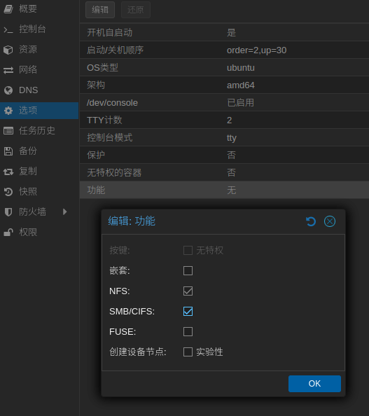

## 安装 PVE

首先开启 Bios 虚拟化有关的选项，
之后根据 [官方文档](https://pve.proxmox.com/wiki/Installation) 进行安装。

### 增加对 EMMC 存储的支持

部分设备如 R86S 等带有 EMMC 存储的设备，将 PVE 安装在 EMMC 存储中需要进行特殊步骤。

#### 原理

Install Proxmox VE (Debug mode) 提供了在安装过程中各个阶段执行脚本的能力，修改文件为安装程序提供 MMC 设备检测支持。  
不直接修改 ISO 主要是由于，一是该文件在 pve-installer.squashfs 中，由安装程序在运行的时候加载，修改需要解包后重新打包，二是这样更透明，避免使用一个来源不是很明确的二进制文件。  
安装过程中，配置信息时使用了 Linux 的图形界面，类似于 Ubuntu 的使用，按下 Ctrl+Alt+F1/F2 为相应的日志信息，按下 Ctrl+Alt+F3 可以切换出命令行，按下 Ctrl+Alt+F4 可以切换回图形界面。

PVE 并未针对这种设备优化，eMMC 也并非针对这种使用设计。PVE 每天要往存储设备中写入一定量的日志信息，可能造成设备寿命缩短！

#### 操作

启动 PVE 安装程序，进入安装初始界面；

选择 `Install Proxmox VE (Debug mode)` 启动；

在第一次提示输入命令的时候按下 <kbd>Ctrl</kbd>+<kbd>D</kbd> ，继续安装过程；

在第二次提示输入命令的时候输入 `vi /usr/bin/proxinstall` 编辑文件（或者使用其他文字编辑器如 nano）；

输入 `/unable to get device` 回车，定位到对应位置；

可以看到类似下方的内容，添加下方 6-8 行的 mmcblk 这段 if-else 循环：

```diff
...
    } elsif ($dev =~ m|^/dev/[^/]+/hd[a-z]$|) {
        return "${dev}$partnum";
    } elsif ($dev =~ m|^/dev/nvme\d+n\d+$|) {
        return "${dev}p$partnum";
+    } elsif ($dev =~ m|^/dev/mmcblk\d+$|) {
+        return "${dev}p$partnum";
    } else {
        die "unable to get device for partition $partnum on device $dev\n";
    }
...
```

然后按下 <kbd>Ctrl</kbd>+<kbd>D</kbd> ，继续安装过程；  
此时应该进入了正常的安装程序，硬盘选择的时候选择 `/dev/mmcblk1` ；（没有 bootX 后缀）
最后安装完成后按下 <kbd>Ctrl</kbd>+<kbd>D</kbd> ，重启系统。

建议关闭 swap，避免频繁写入。

## 换源

### Proxmox 软件源

```shell
# 注释掉企业源
mv /etc/apt/sources.list.d/pve-enterprise.list /etc/apt/sources.list.d/pve-enterprise.list.bak
# 南京大学 Proxmox 软件源
echo "deb https://mirrors.nju.edu.cn/proxmox/debian bookworm pve-no-subscription" > /etc/apt/sources.list.d/pve-no-subscription.list
```

### Debian 系统源

```shell
# 阿里 Debian 源
sed -i.bak "s#ftp.debian.org/debian#mirrors.aliyun.com/debian#g" /etc/apt/sources.list
sed -i "s#security.debian.org#mirrors.aliyun.com/debian-security#g" /etc/apt/sources.list
apt update && apt-get install -y apt-transport-https ca-certificates  --fix-missing
# 刷新软件列表并更新系统
apt update && apt dist-upgrade
```

### LXC 仓库源

```shell
# 南京大学 LXC 仓库源
sed -i.bak "s#http://download.proxmox.com/images#https://mirrors.nju.edu.cn/proxmox/images#g" /usr/share/perl5/PVE/APLInfo.pm
wget -O /var/lib/pve-manager/apl-info/mirrors.nju.edu.cn https://mirrors.nju.edu.cn/proxmox/images/aplinfo-pve-7.dat
systemctl restart pvedaemon
```

### Ceph 源

```shell
echo "deb https://mirrors.ustc.edu.cn/proxmox/debian/ceph-quincy bookworm no-subscription" > /etc/apt/sources.list.d/ceph.list
sed -i.bak "s#http://download.proxmox.com/debian#https://mirrors.ustc.edu.cn/proxmox/debian#g" /usr/share/perl5/PVE/CLI/pveceph.pm
```

## 配置

### 去除 PVE 登录弹窗

```shell
sed -Ezi.bak "s/(Ext.Msg.show\(\{\s+title: gettext\('No valid sub)/void\(\{ \/\/\1/g" /usr/share/javascript/proxmox-widget-toolkit/proxmoxlib.js
systemctl restart pveproxy.service
```

## 直通

直通首先需要开启内核的 IOMMU 功能，修改 `/etc/default/grub` 文件，添加 `intel_iommu=on` 选项：

```text
# GRUB_CMDLINE_LINUX_DEFAULT="quiet"
GRUB_CMDLINE_LINUX_DEFAULT="quiet intel_iommu=on"
```

更新一下 Grub 的配置：

```shell
update-grub
```

编辑 `vim /etc/modules` 文件，加载内核模块，添加下列内容：

```text
vfio
vfio_iommu_type1
vfio_pci
vfio_virqfd
```

在 Proxmox VE 中安装 openwrt 路由
重启设备即可开启 IOMMU 功能。

### 网卡直通

开启 IOMMU 后可直接在网页的虚拟机硬件中 `添加PCI设备` ，选中需要直通的网卡即可。

### 硬盘直通

#### RDM 方式

nvme 或其他走 PCI-E 通道的硬盘不建议使用这种方式，一般作为机械硬盘的直通方式。
先使用一下命令查看硬盘名称：

```shell
ls /dev/disk/by-id/
```

会得到诸如 `ata-xxxx` 或 `nvme-xxxx` 形式的硬盘名称 `${DISK_NAME}` ；使用以下命令将硬盘添加到虚拟机中：

| 变量名         | 示例                                           | 描述      |
| :------------- | :--------------------------------------------- | :-------- |
| `${VM_ID}`     | 101                                            | 虚拟机 ID |
| `${DISK_NAME}` | nvme-Samsung_SSD_970_EVO_500GB_S5H7NS0NC21945D | 硬盘名称  |

```shell
qm set ${VM_ID} -scsi1 /dev/disk/by-id/${DISK_NAME}
```

此处的 `-scsi1` 可修改为 `-sata0` 或 `-ide2` 等未占用的通道。

#### 直通 PCI 设备方式

走 PCI-E 通道的硬盘，诸如 nvme 固态、阵列卡等可通过直通 PCI 通道的方式直通给虚拟机。
直接在 Web 界面中通过 `添加` - `PCI 设备` 进行添加就可以了。

### 显卡直通



显卡直通操作并未获得成功，请谨慎操作。



#### PVE 操作

首先修改 Grub 配置文件 `/etc/default/grub` 开启虚拟化并关闭显卡启动选项 `intel_iommu=on` 、 `video=efifb:off`：

```text
# GRUB_CMDLINE_LINUX_DEFAULT="quiet"
GRUB_CMDLINE_LINUX_DEFAULT="quiet intel_iommu=on video=efifb:off"
```

编辑 `/etc/modprobe.d/blacklist.conf` 文件，添加下列驱动到 PVE 黑名单：

```text
blacklist snd_hda_intel
blacklist snd_hda_codec_hdmi
blacklist i915
```

查找核显和声卡的 `${PCI_id}` ：

```shell
lspci
```

可以看到屏幕上显示的 `VGA compatible controller` 和 `Audio device` ，他们分别为显卡和声卡，记录前面的 `xx:xx` ，此为硬件的 ${PCI_ID} 。

查询核显和声卡的 `${HARDWARE_ID}` ：

```shell
lspci -n -s ${PCI_ID}
```

输出的 `8086:xxxx` 即为核显和声卡的 `${HARDWARE_ID}` 。

编辑 `/etc/modprobe.d/vfio.conf` 文件添加直通组，多个设备可在 ids 后面每个设备之间用 `,` 隔开：

| 变量名           | 示例      | 描述    |
| :--------------- | :-------- | :------ |
| `${PCI_ID}`      | 00:02.0   | PCI ID  |
| `${HARDWARE_ID}` | 8086:4e61 | 硬件 ID |

```text
options vfio-pci ids=${HARDWARE_ID_1},${HARDWARE_ID_2}
```

编辑 `/etc/modprobe.d/kvm.conf` 添加 options 防止 VM 死机

```text
options kvm ignore_msrs=1
```

更新内核并重启 PVE 虚拟机

```shell
update-initramfs -u
reboot now
```

重启完成后，输入命令检查模块是否加载成功

```shell
lsmod | grep vfio
```

#### 虚拟机操作

创建虚拟机需要使用 q35 型号，CPU 需要选择 host 模式以及打开 NUMA 。

安装 windows 系统后不要联网，进入系统后马上在设备管理器中安装核显驱动，装好后关机。

上传核显 vBios `igup.bin` 到 PVE 下的 `/root/` 目录下；

在网页中删除直通的核显；

默认的显示设备设置为无，并增加声卡的直通；

使用下面的命令添加核显直通：

| 变量名          | 示例    | 描述              |
| :-------------- | :------ | :---------------- |
| `${PCI_ID}`     | 00:02.0 | PCI ID            |
| `${PCI_ID_HEX}` | 0x02    | PCI ID 的 16 进制 |

```shell
args: -device vfio-pci,host=${PCI_ID},addr=${PCI_ID_HEX},x-igd-gms=1,romfile=/root/igpu.bin
```

## LXC 挂载 nfs

默认的 LXC 容器由于安全等原因并不支持直接挂载 nfs / samba / cifs，但可通过一些方式开启。

### webui

特权容器在 `选项` - `功能` 中开启支持。



### 修改配置文件

增加配置模板：

```shell
cp -i /etc/apparmor.d/lxc/lxc-default-cgns /etc/apparmor.d/lxc/lxc-default-with-nfs
nano /etc/apparmor.d/lxc/lxc-default-with-nfs
```

```diff
# Do not load this file.  Rather, load /etc/apparmor.d/lxc-containers, which
# will source all profiles under /etc/apparmor.d/lxc

profile lxc-container-default-with-nfs flags=(attach_disconnected,mediate_deleted) {
  #include <abstractions/lxc/container-base>

  # the container may never be allowed to mount devpts.  If it does, it
  # will remount the host's devpts.  We could allow it to do it with
  # the newinstance option (but, right now, we don't).
  deny mount fstype=devpts,
  mount fstype=cgroup -> /sys/fs/cgroup/**,
  mount fstype=cgroup2 -> /sys/fs/cgroup/**,
  mount fstype=overlay,

+ # allow nfs mount
+ mount fstype=nfs,
+ mount fstype=nfs4,
+ mount fstype=nfsd,
+ mount fstype=rpc_pipefs,
}
```

重启服务：

```shell
systemctl reload apparmor
```

修改容器配置：

```shell
nano /etc/pve/lxc/${LXC_ID}.conf
```

```diff
parent: media_ready
rootfs: local-zfs:basevol-200-disk-0/subvol-201-disk-0,size=8G
startup: order=2,up=30
swap: 512
lxc.cgroup2.devices.allow: c 226:1 rwm
lxc.cgroup2.devices.allow: c 226:128 rwm
lxc.cgroup.devices.allow: c 29:0 rwm
lxc.autodev: 1
lxc.hook.autodev: /var/lib/lxc/201/mount_hook.sh
+ lxc.apparmor.profile: lxc-container-default-with-nfs
```

在容器中挂载：

```shell
vim /etc/fstab
```

```text
# NFS mount
# [nfs_ip]:[nfs_export] [local_mountpoint] nfs auto,nofail,noatime,nolock,intr,tcp,actimeo=1800 0 0
192.168.10.254:/mnt/hddpool/drama /mnt/drama nfs auto,nofail,noatime,nolock,intr,tcp,actimeo=1800 0 0
192.168.10.254:/mnt/hddpool/video /mnt/video nfs auto,nofail,noatime,nolock,intr,tcp,actimeo=1800 0 0
192.168.10.254:/mnt/buffer/bangumi /mnt/bangumi nfs auto,nofail,noatime,nolock,intr,tcp,actimeo=1800 0 0
```
